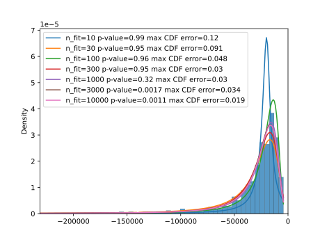

Monte Carlo Simulation
========================

Problem
------------------------

Generate  distribution  of  0.01  quantile  (1%  percentile)  of  10-days
overlapping proportional returns  obtained  from  the 3-years  timeseries 
(750  observations)  of 1-day proportional returns.  Original  timeseries 
of 1-day proportional returns is generated  using  stable  distribution  with  the
following  parameters: $\alpha  =  1.7$;  $\beta  = 0.0$;  $\gamma = 1.0$; $\delta = 1.0$.

Show,  either  numerically  or  theoretically,  that the  chosen  number  of 
Monte-Carlo trials is sufficient.

Problem analysis
------------------------

### Overlapping returns


$n$-day proportional return at $i$-th day is defined as

$r^n_i = \frac{P_{i+n} - P_i}{P_i}$

where $P_i$ is an asset price at $i$-th day.

Therefore 10-day proportional returns can be obtained from 1-day series as

$r_{i}^{10} = \left(\prod_{j=0}^{9} (r^1_{i+j} + 1) \right) - 1$

### Stable distribution

The family of stable distributions is notable for the property to preserve 
the shape of distribution for linear combinations of random variables.
Timeseries distributed according to such distributions, for example asset prices
or absolute returns, demonstrate time-scale invariance due to that property.
In case of small price fluctuations these distributions can also be considered for
proportional returns due to near-zero approximation $x \approx \log(x+1)$.
But in this problem price fluctuations are too high for this approximation to be valid,
so we can't exploit properties of stable distribution for analytical evaluation
of 10-day returns from 1-day series. Hence need of Monte Carlo simulation.

Another notable peculiariy of the stable distribution in this problem is its infinite variance. 
It makes it impossible to use central limit theorem for estimation of sample mean variance, and
therefore confidence interval of the estimated average. 


Simulation code
------------------------

The simulation script `sample_q1.py` contains 3 function:

*  `quantile()` generates one random 0.01 quantile of 10-day proportional returns as described
	by the problem. Generation is performed via sampling 750 1-day returns. Monotonic 
	interpolation is used for quantile extraction from empitical distribution.
    using `scipy.stats.levy_stable` class.

*  `quantile_sample()` generates requested number of samples of 0.01 quantiles

*  `main()` main simulation function. Simulation consists of three stages: (1) generation and analysis 
    of 10 independent samples, (2) fitting parameters of stable distribution to
    samples of various sizes, and (3) using 2-sample Kolmogorov-Smirnov tests to evaluate
    accuracy of empirical CDF estimations.
    Fitting of distribution parameters is performed by stochastic
    optimizer `scipy.optimise.differential_evolution` with maximum likelihood estimator 
    as a goal function. Quality of fitting is assessed by 1-sample Kolmogorov-Smirnov test.
    In the end the function plots sample histogram and density functions of 
    the fitted stable distributions. For reproducible results the random seed is fixed.

Simulation results
----------------------

### Mean estimation

The listing below shows output of the first simulation stage. 
10 independent samples of size 1000 have been drawn.
Sample standard deviations ($\hat{\sigma_s}$) were used as estimates of
of standard deviation of the population $\sigma$ for estimation of standard deviation of 
estimated mean values $\sigma_\mu$:

$$\sigma_\mu = \frac{\sigma}{\sqrt{N}} \approx \frac{\hat{\sigma_s}}{\sqrt{N}} $$

where $N$ is sample size ($N=1000$ in this simulation). 

The 95% confidence interval was estimated as $\hat{\mu} \pm 2\sigma_\mu$, where $\hat{\mu}$ 
is a sample average.

```
Estimating 0.01 quantile value by Monte Carlo sampling
Size of samples: 1000                       
Sample average   Sample stdev  Est. stdev of average   95% confidence interval          
     -38355.35       44462.77                1406.04    (-41167.42, -35543.28)
     -36948.17       64679.37                2045.34    (-41038.85, -32857.48)
     -36626.16       42900.67                1356.64    (-39339.44, -33912.89)
     -35150.33       46465.15                1469.36    (-38089.04, -32211.62)
     -36078.08       65963.74                2085.96    (-40249.99, -31906.17)
     -37392.57       63096.54                1995.29    (-41383.14, -33401.99)
     -35312.36       47506.60                1502.29    (-38316.95, -32307.78)
     -50500.07      349377.28               11048.28    (-72596.63, -28403.51) 
     -37533.27       48263.07                1526.21    (-40585.70, -34480.85)
     -37272.02       64620.60                2043.48    (-41358.99, -33185.06)
```

Means and standard deviations of 10 independent samples of size 1000 have 
demonstrated heavy fluctuations with and even an outlier.
It gives a hint that the quantile distribution may also be of a stable family.
In that case estimations of the mean variance $\sigma_\mu$ as well as the confidence
intervals are meaningless, because standard deviation of the population may be infinite.

### Stable distribution fitting

Parameters of the stable distribution were fitted to samples of size 
10, 30, 100, 300, 1000, 3000, and 10'000.
The simulation output is shown below, after the generated plot. 

 


```
Fitting...
Fitting...done in 5.85 sec
    params: (0.9291905286299762, -0.10456538941368568, -15734.087581848526, 4882.0617524482)
    K-S test for n_fit=10: p-value=0.9924 statistic=0.1241
Fitting...
Fitting...done in 37.41 sec
    params: (1.0527335628378047, -0.9940350646898084, -139992.55078304262, 9963.188653322068)
    K-S test for n_fit=30: p-value=0.9457 statistic=0.09102
Fitting...
Fitting...done in 121.45 sec
    params: (1.044312438190198, -0.9995666768485871, -109227.9258963601, 6479.441248598923)
    K-S test for n_fit=100: p-value=0.9642 statistic=0.04843
Fitting...
Fitting...done in 290.63 sec
    params: (1.1304405722083923, -0.9999937847943913, -63448.996853570774, 9020.786198833028)
    K-S test for n_fit=300: p-value=0.9484 statistic=0.02958
Fitting...
Fitting...done in 990.54 sec
    params: (1.1131069488802394, -0.9999999999998475, -63368.63562890383, 8024.5758130497325)
    K-S test for n_fit=1000: p-value=0.323 statistic=0.02999
Fitting...
Fitting...done in 3353.56 sec
    params: (1.1086189100012942, -0.9999872935898656, -67357.89048512778, 8246.235255175263)
    K-S test for n_fit=3000: p-value=0.001728 statistic=0.03423
Fitting...
Fitting...done in 13184.82 sec
    params: (1.0826340522804445, -0.9997624503588005, -82944.67605911131, 8304.464743379558)
    K-S test for n_fit=10000: p-value=0.001059 statistic=0.0194
Plotting...
```

The maximum CDF error (shown as `statistic` parameter of the K-S test in the output) 
decreases with the size of samples (down to 0.02 for sample size 10000).
But $p$-value also decreases to insignificant level.
It means that  although the stable distribution can approximate the simulate quantile
distribution with a known accuracy, there is subtle yet significant difference between
them. Therefore we can make only speculative conclusions about the quantile distribution
 based on the fitted stable distribution. 

It is possible that a better fitting algorithm may produce a better parameterization
of the stable distribution, closer the simulated samples.

It worth noting that the mean value of the fitted distributions 
(the third parameter $\gamma$) fluctuates heavily between samples and well outside of 
the confidence intervals obtained at the first stage of the simulation.

### Empirical CDF accuracy estimation

Two-sided Kolmogorov-Smirnov test was performed for pairs of samples 
of size 10, 20, 100, 300, 1000, 3000, 10'000, 30'000, and 100'000.
The script output is shown below:

```
    K-S test for n_fit=10: p-value=0.7869 statistic=0.3
    K-S test for n_fit=30: p-value=0.03458 statistic=0.3667                                
    K-S test for n_fit=100: p-value=0.4695 statistic=0.12    
    K-S test for n_fit=300: p-value=0.6536 statistic=0.06
    K-S test for n_fit=1000: p-value=0.9358 statistic=0.024
    K-S test for n_fit=3000: p-value=0.2908 statistic=0.02533
    K-S test for n_fit=10000: p-value=0.6518 statistic=0.0104
    K-S test for n_fit=30000: p-value=0.1597 statistic=0.009167
    K-S test for n_fit=100000: p-value=0.1685 statistic=0.00497
```

This output shows that the maximum CDF error below 2% may be achieved for
sample size above 10'000, and this error may be driven below 1% for 
sample size above 30'000. For sample sizes below 300 the error of
empirical CDFs is larger than the error of stable distribution fitted 
to samples of the same size.


Conclusions
---------------

The distribution of the 1% quantile of the 10-day overlapping returns requested 
can be approximated by a stable distribution function with the following 
parameters $\alpha = 1.08$, $\beta = -1$, $\gamma = -82944.68$, $\delta = 8304.46$, 
that were fitted to a sample of 10'000 simulated quantile values. The estimated 
maximal CDF error of this approximation is about 2%. 

The maximal CDF error below 1% can be achieved with an empirical CDF function
obtained from samples of size above 30'000.


